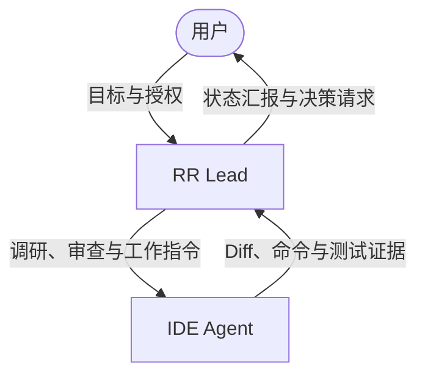

# Research Review Lead Loop Specification

## Purpose and boundaries

Research Review Lead Loop（RR Loop）是 Agent Project System 的第一个正式运行模块。它让用户、浏览器端 RR Lead 与本地 IDE Agent 在不能直接互相控制的情况下，通过轻量 Packet、真实执行证据和明确下一步持续推进一个 Work Item。

通用 Review Trigger、Review Request/Decision Contract、Decision 行为与 Completion Authority 由 `docs/specs/agent-collaboration-protocol.md` 唯一规定。本 Spec 只保留 RR Lead 模块的角色、Packet、Transport、恢复与当前实现映射，不复制通用协议。

OpenCLI 的 Session Discovery、五类 Conversation identity、发送前目标绑定、投递验证与 exact-ID recovery 由 `docs/specs/opencli-session-discovery.md` 唯一规定。本 Spec 中的 Transport 内容只记录 RR-specific envelope、当前实现映射与历史 Evidence，不另立身份 Contract。



## Roles

- **用户：** 决定目标、优先级、体验、成本、权限、隐私与风险取舍。
- **RR Lead：** 主要用户沟通端；负责必要的外部调研、技术判断、IDE 结果审查和下一目标推进。不得无视本地证据或索取凭据。
- **IDE Agent：** 负责项目内文件编辑、命令执行、测试和本地事实报告。不得隐藏错误、擅自扩大范围、安装未授权依赖或向外发送文件。

RR Lead 监督方向和质量；IDE Agent 用本地事实监督并纠正纸面判断。真实文件、测试输出和 Git Diff 优先于未验证的外部推测。

### Browser / Product / Lab collaboration

```text
Browser Lead
↔ Product Agent
↔ Lab Agent
```

- **Product Agent** owns the Product Problem、Contract、Acceptance Criteria、implementation 与 regression tests；它不得把 Lab prototype 直接当作 Product source。
- **Lab Agent** 只接受边界明确的 `LAB_EXPERIMENT_HANDOFF`，对不确定的外部 runtime/Browser 机制做最小实验，保存 raw Evidence 并返回 Reference Probe；不得直接修改 Product 仓库或扩大 Product Contract。
- **Browser Lead** 审查 Product Contract 与 Lab Evidence，明确区分技术结果、实验合规和未验证项，再把清理后的 Review Decision / Work Order 交回 Product Agent；不得把 Lab 自报 PASS 直接提升为 Product 事实。

GitHub Review Branch + exact Commit SHA 是 Browser 可访问时优先的 Artifact Review Path，不是实时 Transport。跨 Browser Conversation 时，新的 Browser Lead 必须从 Handoff 给出的 exact ref 读取 `README.md` 及其 startup order，而不是依赖旧聊天摘要。

## Goal Contract and information exchange

Context Packet 必须定义所有参与者共同使用且不会被 RR Lead 静默扩大的 Goal Contract：`WORK_ITEM_ID`、`SHARED_OBJECTIVE`、`ACCEPTANCE_CRITERIA`、`SCOPE`、`CONSTRAINTS`、`EVIDENCE_REQUIRED` 和 `STOP_CONDITIONS`。新发现但不阻塞本目标的改进进入 Debt；改变验收条件必须由用户明确决定。

- Context Packet：首次同步目标、验收标准与必要背景。
- Change Packet：返回变更摘要、关键 Diff、验证命令、退出码和必要输出。
- Decision Request：仅在用户决策闸口使用。
- Handoff：对话不再可靠继续时的最小接力信息。

模板随源 Skill 包位于 `skills/research-review-lead/assets/`。实际填写的 Packet 默认作为消息传递，不提交到目标项目。浏览器与 IDE 彼此隔离，不依赖自动文件上传。

Evidence Packet 使用通用核心，将目标、范围、产物、验证、来源、不确定性、验收映射、Blocker 和 Debt 分开。Git Diff、命令和退出码只在项目实际使用这些证据时提供；备课、文档、调研和非 Git 项目使用其可复查的产物、来源、覆盖与观察结果。

项目使用 Git 且 Browser Lead 可访问 GitHub 时，Evidence Packet 优先引用已 push 的 Review Branch、Commit SHA 与适用的 baseline SHA，让 Browser 直接审查真实代码和 Diff。该路径只是 `agent-collaboration-protocol.md` 所定义的 Review Artifact access path；没有 GitHub 时继续使用 Evidence Packet 正文或 Manual Relay，GitHub 不承担 RR Decision 或消息 Transport。

## Loop

1. IDE 核验当前 Work Item 与本地状态，必要时用 Context Packet 提供背景。
2. RR Lead 检查目标、进行必要调研并下发可执行的 `NEXT_WORK_ORDER` 与验证标准。
3. IDE 在授权范围内执行，用适合当前项目类型的真实证据形成 Evidence Packet。
4. RR Lead 分别给出本轮审查结论和整个任务状态，区分 Blocker 与 Debt，并给出下一步。
5. 当 IDE Agent 声称已达到验收标准时，必须按通用协议提交 Final Review；只有 Browser Lead 返回匹配的 Final `APPROVE` 后任务才可进入 `ACHIEVED`。需要用户决定时进入 `NEEDS_DECISION`；否则继续推进。

只要 Work Item 为 `IN_PROGRESS`、存在可执行的 `NEXT_WORK_ORDER`、没有用户决定或安全风险，并且存在新增证据或合理新路径，循环就继续。协议不使用“无限循环”：`ACHIEVED`、`BLOCKED`、`NEEDS_DECISION`、`STALLED` 和 `UNSAFE` 都会停止本地执行。

## Review decision and work item state

以下字段是 RR Lead 模块现有 wire Contract，不是 ACF 通用协议的第二套权威。ACF-0.1 使用 `APPROVE / REVISE / ESCALATE_TO_USER`，并把 Debt 作为独立字段；Product Loop Bridge 负责严格兼容映射，冻结的 Transport 仍只承担消息身份、Conversation 来源和回复 envelope 验证。

两个字段不得混用：

```text
REVIEW_DECISION:
PASS / PASS_WITH_DEBT / REVISE / ESCALATE

WORK_ITEM_STATE:
IN_PROGRESS / ACHIEVED / BLOCKED / NEEDS_DECISION / STALLED / UNSAFE
```

例如 `REVIEW_DECISION: PASS_WITH_DEBT` 与 `WORK_ITEM_STATE: IN_PROGRESS` 表示本轮实现通过但整个任务仍需继续。

RR Lead 每轮响应还应包含 `ACCEPTANCE_STATUS`，逐条给出 Criterion、`MET / NOT_MET / UNVERIFIED`、Evidence，并包含 `FINDINGS`、`BLOCKERS`、`DEBT`、`NEXT_WORK_ORDER`、`VALIDATION` 和 `USER_DECISION_REQUIRED`。非阻塞建议只能进入 Debt，不能阻止主线完成；只有所有原验收条件都有充分证据且为 `MET`，并满足 ACF Protocol 的 Final Review Completion invariant，才允许进入 `ACHIEVED`。

### ACF-0.1 compatibility bridge

`runtime/review_loop.py` 是最小 IDE-independent Product Workflow bridge；`scripts/acf_review_loop.py` 只负责其 JSON 状态的原子持久化。它们不发送消息、不建立 Conversation，也不翻译 Antigravity lifecycle。正式回复只有在冻结 Transport 已给出 `official_response_eligible=true`、`RESPONSE_IDENTITY_VERIFIED`，并且 Transport Work Item/Message ID 与当前 pending Request 精确相等时，才允许进入该 bridge。Transport 自身的 `work_item_state=ACHIEVED` 只是“已取得 identity-bound RR response”的旧标签，绝不是 Product Completion Authority。

为不向冻结 RR wire parser 增加 ACF-specific 顶层字段，Browser Lead 在现有 `VALIDATION` 多行字段中返回以下精确 compatibility binding：

```text
ACF_BINDING_BEGIN
PROTOCOL_VERSION: ACF-0.1
IN_REPLY_TO_REVIEW_REQUEST_ID: <exact REVIEW_REQUEST_ID>
REVIEW_KIND: INTERMEDIATE / FINAL
ACF_BINDING_END
```

wire `IN_REPLY_TO_MESSAGE_ID` 必须与 `IN_REPLY_TO_REVIEW_REQUEST_ID` 相等；正式 Loop 直接让 Transport `MESSAGE_ID` 使用当前 `REVIEW_REQUEST_ID`。`ACCEPTANCE_STATUS` 必须以唯一的 `CRITERION / STATUS / EVIDENCE` 项精确覆盖 pending Request 的 agreed criteria；`NEXT_WORK_ORDER` 映射为 ACF `REQUIRED_ACTIONS`。`PASS` 与 `PASS_WITH_DEBT` 兼容映射为 `APPROVE`，`ESCALATE` 映射为 `ESCALATE_TO_USER`；新 Loop 应优先直接返回 ACF decision 名称。缺字段、重复字段、无效状态、绑定冲突或 artifact identity stale 一律是 `NON_AUTHORITATIVE`，当前 Review 保持 pending。

Bridge 只实现真实两轮 MVP 所需状态迁移：

```text
EXECUTING
→ submit Final Request + reviewed artifact identity
→ FINAL_REVIEW_PENDING
→ authoritative REVISE
→ REVISION_REQUIRED + CURRENT_REQUIRED_ACTION + bounded CONTINUATION_STATE
→ revision Evidence recorded
→ EXECUTING
→ new Final Request ID + current artifact identity
→ FINAL_REVIEW_PENDING
→ authoritative current APPROVE
→ Completion Gate revalidation
→ COMPLETED
```

Final `APPROVE` 的 `REVIEWED_STATE_CURRENT` 由 Product bridge 比较 pending reviewed artifact identity 与接收 Decision 时的 current artifact identity 后生成，不读取 Browser 自报布尔值。实质修改必须使旧 reviewed snapshot 失效。Completion Gate 仍重新验证 Protocol、Work Item、Request ID、Review Kind、全部 agreed criteria 精确覆盖且为 `MET`、无 unresolved User Decision 与 current reviewed state；Execution termination 和 Stop Hook `continue` 均不能替代该审查权。

## Sixth-round health checkpoint

第六轮是强制健康检查点，不是硬性终止上限。检查：

- 是否忘记原目标；
- 是否发生范围漂移；
- 是否重复相同建议；
- 是否没有新增证据；
- 是否已经陷入停滞；
- 当前对话是否仍能可靠继续。

没有异常时允许继续同一 Work Item。只有出现上述问题、硬阻塞、长时间等待决定或对话已不可靠时，才生成 Handoff 并考虑切换对话；不得为了轮数机械结束任务，也不猜测 Token 上限。

## Handoff and resume

- 源 Skill 包只保留一个 `assets/handoff.md` 权威模板，不为 IDE Agent 和 RR Lead 创建两套独立模板。
- 所有交接都填写 Common Handoff Core：Work Item ID、Conversation ID、交接原因、目标、验收标准、任务状态、确认事实、已有决定、Blocker、Debt、下一步和必读权威文件。
- IDE Agent 交接时再填写 IDE Agent Extension，提供仓库、Git、命令、退出码、测试、关键 Diff、本地限制和禁止重复的失败路径。
- RR Lead 交接时再填写 RR Lead Extension，提供用户意图、待决策项、外部调研、已否定路线、审查结论、任务状态、判断理由、下一工作指令和漂移检查。
- 未交接的角色扩展直接省略，不填写大量“不适用”字段，也不复制模板。
- 不得为了 Handoff 默认执行 `git add` 或 `git stash`，不得擅自改变用户工作区。
- 实际 Handoff 默认只作为消息；长期事实更新到唯一的 `docs/current.md`。
- 不在 `state/` 或其他目录积存日期 Handoff。只有用户明确批准后，实际 Handoff 才可通过文档闸门长期保存。
- 接手者先读 `docs/current.md` 与相关证据，从明确的下一动作继续。

## User decision gates

只在以下情况暂停：目标或产品方向变化；成本或付费；账号和权限；隐私和私人数据；文件公开或上传；删除、覆盖或其他不可逆操作；重大安全风险；当前目标无法实现且需要接受降级。决策请求必须给出三个白话选项和一个推荐。

## MVP limits

第一版只允许一个 Active Work Item；不开发多任务调度、自动通知、GitHub Issues/Projects 同步或图形界面。普通 Git 与远端仓库可用于保存历史。

RR Lead 在具有项目权威入口时采用 Full Governance Mode，并服从目标项目自己的规则和状态源；没有完整治理结构时采用 Compatibility Mode，以用户请求和现有入口运行，不强制 Git、`docs/current.md` 或治理初始化。

## OpenCLI runtime orchestration

运行循环明确区分三类 Agent：Builder IDE Agent 只维护源包；IDE-side Loop Driver 在目标项目读取事实、交换 Packet 并执行 Work Order；Browser RR Lead 必须真实存在于 ChatGPT 浏览器对话中，负责外部调研、审查和推进。Loop Driver 不得冒充 Browser RR Lead，也不得用本地意见伪造浏览器回复。

目标循环为：

```text
共同目标
→ IDE 执行
→ IDE 提交证据
→ RR Lead 按验收标准审查
→ 未达到则给修复指令
→ IDE 修复并重新提交证据
→ 全部达到则 ACHIEVED
```

Loop Driver 必须保存 Work Item ID、Conversation ID 或 URL、轮次、最后成功读写时间和当前状态，不得只依赖当前浏览器标签页。只有状态为 `IN_PROGRESS`、不存在用户决策闸口且操作在授权范围内时才执行 `NEXT_WORK_ORDER`。

当 Browser RR Lead 返回 `NEEDS_DECISION` 时，Loop Driver 停止执行并等待用户在同一 Browser 对话中回答。用户明确表示已回答后，Loop Driver 用记录的对话身份重新读取，核对 Work Item 和选择，形成 Decision Receipt，再恢复原循环；第一版不自动轮询。

### Transport Smoke 取证事实

2026-08-05 的 `TRANSPORT-SMOKE-001` 产生了两次 `ask --new` 超时。只读 history/detail 恢复确认两个命令分别建立了一个对话，两个用户消息均已投递，两个 Browser 回复均已完成；同一 Work Item 因超时后重发而出现一个额外重复对话。显式 Conversation ID detail 对两个对话均可稳定恢复。OpenCLI 输出不含消息时间戳，因此本次无法从 CLI 精确证明消息和回复时刻。

故障发生在创建和投递之后的等待完成检测或结果返回边界，而不是已证实的发送失败。history 的观测顺序不能当作 newest-first 合约；恢复必须比较发送前后的 ID 集合，再以唯一 `MESSAGE_ID` 核验候选对话。

`TRANSPORT-RECOVERY-002` 又证明 `ask --new` 可能在两个发送前已存在的 Conversation 之间错投：命令报告目标 Conversation 与最终页面 URL 不同，Runtime 只记录 `DELIVERY_UNKNOWN`，而旧恢复逻辑排除了所有发送前 ID，导致已送达消息不可恢复。该实验随后发生计划外发送和探针污染，因此不得作为 A2 通过证据。

### Current OpenCLI delivery mapping

以下字段和流程描述当前 RR Lead Wrapper 对 Session Discovery Contract 的实现映射与历史限制，不是第二套 Conversation identity 权威。`OPENCLI-SESSION-DISCOVERY-001` 将在不改变 RR Review authority 的前提下，使旧字段迁移到五类明确 identity。

每个 Browser 消息必须包含 `WORK_ITEM_ID`、唯一 `MESSAGE_ID`、`ROUND` 和 `MESSAGE_TYPE`。同一个 `MESSAGE_ID` 在确认失败前不得重发。传输维护：

```text
NOT_SENT
CREATING_CONVERSATION
VERIFYING_CONVERSATION
SENDING
SENT
DELIVERY_UNKNOWN
MISROUTED_DELIVERY
DELIVERED
RESPONSE_PENDING
RESPONSE_READY
FAILED
```

正式 RR Lead 回复采用两层身份绑定。Transport 必须把一次 `detail` 或同一次 `ask` 结果产生的 Conversation ID、messages、来源类型和原始输出路径封装成不可拆分的 `ResponseMessageBatch`。`verified_target_conversation_id` 必须在进入正式回复验证前由调用层显式建立；`accept_delivery` 只能消费该 Batch，不得写入或覆盖 verified target。传输来源必须证明 `response_batch.conversation_id == verified_target_conversation_id`，不得信任回复正文自报的 Conversation ID。

正式回复必须由第一条非空行 `RR_REVIEW_BEGIN` 和最后一条非空行 `RR_REVIEW_END` 完整封包，封包外不得有说明、示例、引用或其他文字。封包内必须完整包含 `WORK_ITEM_ID`、`IN_REPLY_TO_MESSAGE_ID`、`ROUND`、`REVIEW_DECISION`、`WORK_ITEM_STATE`、`ACCEPTANCE_STATUS`、`FINDINGS`、`BLOCKERS`、`DEBT`、`NEXT_WORK_ORDER`、`VALIDATION` 和 `USER_DECISION_REQUIRED`；字段不得重复，前三项必须分别与当前 Work Item、最后发送的完整 Message ID 和预期 Round 精确相等。

解析器先在已验证 Conversation 的有序消息中收集同时精确包含目标 `WORK_ITEM_ID` 与 `MESSAGE_ID` 的 user-role 消息。零个返回 `RESPONSE_IDENTITY_MISMATCH`；多于一个返回 `OUTBOUND_MESSAGE_IDENTITY_AMBIGUOUS`，不得任意选择锚点或进入正式 Review Parser；恰好一个时只检查其后的 assistant-role 消息。用户引用、较早回复、其他 Conversation、缺字段、前缀或子串碰撞、封包外文字均不可成为正式审核，也不得本地补值。唯一完整匹配回复进入 `RESPONSE_IDENTITY_VERIFIED`；无回复保持 `RESPONSE_PENDING`，缺字段、身份不匹配、多个完整匹配或来源错误分别记录为 `RESPONSE_IDENTITY_MISSING`、`RESPONSE_IDENTITY_MISMATCH`、`RESPONSE_IDENTITY_AMBIGUOUS` 或 `RESPONSE_SOURCE_CONVERSATION_MISMATCH`。这些失败状态不得进入正式 Review Parser，也不得允许相同 Message ID 重发。

CLI timeout 首先进入 `DELIVERY_UNKNOWN`。`MISROUTED_DELIVERY` 表示消息已确认送达，但进入发送前已存在且不是当前 Work Item 目标的 Conversation。进入后必须禁止相同 Message ID 重发、禁止继续使用错误 Conversation、禁止把其回复作为正式 RR Lead 输出，只记录错误 Conversation ID 与精确 Work Item/Message ID 命中的最少证据，并返回 Work Item `BLOCKED` 请求修复创建流程。旧 Conversation 命中永远不得晋升为 `DELIVERED`。

传输拆成：

```text
PREPARE_MESSAGE
→ CREATE_NEW_CONVERSATION
→ VERIFY_NEW_CONVERSATION
→ SEND_MESSAGE
→ CAPTURE_OR_RECOVER_CONVERSATION_ID
→ POLL_OR_READ_RESPONSE
→ PARSE_RR_REVIEW
```

当前 Wrapper 的正式发送由单一 `send --prepare-new` 调用完成：保存有限 recent history 基线，执行 `opencli chatgpt new`，用 `status` 与 current-page `read` 验证空白环境，再执行一次 `opencli chatgpt send`。发送后必须重新捕获 exact current identity；若 NEW first-write 的 immediate status 仍为 `/new` 或 root，则在 30 秒、最多 10 次的独立只读 phase 内只用 `status` 观察 URL completion。该 phase 不消耗普通 9-command gate，其 elapsed time 从旧 60 秒 operation budget 中显式排除；因此 qualifying operation 的物理 wall-clock 最多增加 30 秒，但 write/recovery/detail budget不变。首次 exact `/c/<id>` 只成为 current/navigation candidate，仍须以唯一 exact Work Item/Message marker 建立 delivery；new-session delivery 随后才可提升为下一轮 target。deadline、attempt exhaustion 或真实 status command error 以不同 stop reason 保持 `DELIVERY_UNKNOWN`，不扫描 history、不重发。后续轮次使用 `send --conversation <TARGET>`，仍须重新验证 current、delivery 与 target，且不使用该 new-session wait。`ask --new` 继续禁止。

正常恢复不得扫描全部 pre-send Conversation。existing-target write 必须先 exact-detail 持久 target，即使 post-send Browser current 仍位于其他 Conversation；new-session 发送后 status 若给出 exact current ID，恢复只对该 exact ID 执行最多一次 detail。status 无 exact ID 时，才刷新同一 bounded history window、排除基线并要求唯一 `NEW_CANDIDATE_DIFF`。只搜索精确 `WORK_ITEM_ID` 与 `MESSAGE_ID`，且必须恰好命中一个 user marker；returned identity、current identity 和 history candidate 都只是 observation，不能单独建立 delivery。当前发送后目标若属于发送前 ID，或 existing-target delivery 与 target 不同，且 exact marker 命中，则为 `MISROUTED_DELIVERY`；找不到或 marker 重复则保持 `DELIVERY_UNKNOWN` 并永久禁止该 Message ID 重发。

Runtime State 至少记录 `work_item_id`、`message_id`、五类 Conversation identity、target-at-send、identity observations/establishment、`delivery_state`、`send_attempt_count`、`recovery_attempt_count`、`misroute_detected`、`started_at`、`stopped_at` 和 `stop_reason`。记录位于系统临时目录且不保存 Cookie、Token 或账号凭据；完成后显式清理。

默认实验预算为 `MAX_SEND_ATTEMPTS_PER_MESSAGE=1`、`MAX_RECOVERY_ATTEMPTS=1`、`MAX_DETAIL_CHECKS=1`、`MAX_EXTERNAL_COMMANDS=9`、`MAX_EXPERIMENT_SECONDS=60`。数值可以在受控实验配置中进一步收紧或明确调整，但必须有限；任一上限到达立即停止。

### Integrated start-new-and-send interface

Wrapper 必须提供单一正式命令 `send --prepare-new`。它在同一进程、同一 Runtime 状态和同一预算内执行：

```text
PRE_SEND_HISTORY_BASELINE
→ CREATE_NEW_CONVERSATION
→ VERIFY_NEW_URL
→ VERIFY_EMPTY_READ
→ SEND_ONCE
→ RECORD_SEND_OBSERVATIONS
→ POST_SEND_STATUS
→ POST_SEND_HISTORY_DIFF_IF_NEEDED
→ AT_MOST_ONE_DETAIL
→ FINAL_STATE
```

发送前验证失败时必须在 write 前停止，两个发送计数保持零。`opencli chatgpt send` 只允许调用一次，并在实际调用边界同时持久化两个发送计数与 canonical write receipt；该 receipt 由 Work Item ID + Message ID 定位且独立于可选 state-file path。崩溃、timeout、`DELIVERY_UNKNOWN`、recovery budget exhaustion 或 `MISROUTED_DELIVERY` 均不得允许同一 Message ID 再次发送或 Manual Relay。

URL 为 `/new` 不足以单独证明页面为空。结构化 OpenCLI 错误码精确为 `EMPTY_RESULT` 时，即使 CLI 返回非零退出码，也允许作为空页面证据；空 JSON 对象或数组同样为空。其他错误码、未知结构或不可解析输出必须以 `READ_UNPARSEABLE` 阻止发送；可识别的真实 ChatGPT 消息必须以 `READ_NOT_EMPTY` 阻止发送。

集成路径必须调用唯一共享的 `classify_chatgpt_read_result`。write 后必须执行一次 status；exact current ID 存在时读取 current page，并只以唯一 exact marker 建立 delivery。send 输出中的 JSON/flat-YAML identity 只记录为候选 observation；若与 post-send current 冲突，不得选择任一方作为 delivery。只有 current-page Evidence 不足时才执行一次 bounded exact detail，或在 current ID 缺失时执行一次 history 差集后再 detail。

不得把 `send --manual-new-url` 作为正式流程或要求用户调整 Browser 页面。旧参数与独立 `prepare-new` 仅保留向后兼容和本地诊断，不是下一次真实实验的前置步骤或验收项。

集成 Runtime schema v5 记录 `operation=START_NEW_AND_SEND`、`prepare_new=true`、基线、new/read 验证、五类 Conversation identity、target-at-send、identity observations/establishment provenance、发送后 status/current-page read、可选 history diff/detail、全部预算与最终 delivery state。Wrapper 自身无法观察的外层 Agent 工具计数仍必须标记为 `UNAVAILABLE`，不得伪报整个实验为零。

本机 OpenCLI `1.8.6` 中，Lab 已观察到：`new` 只返回 Status 并进入 `/new`；首条 `send` 后 `status` 进入 exact `/c/<id>`，current-page `read` 可验证 marker；随后 `send --conversation <TARGET>` 与第二次 marker read 保持同一 Conversation。`read` 仍绑定当前 Browser 页面，不是 arbitrary exact-ID read。该轮没有 bounded post-write history delta，也没有自然 timeout，因此不得据此声明无额外 Conversation 或 timeout recovery 已通过。

### 实验 Agent 协议

每条 Transport 或 Loop 实验 Prompt 都必须明确禁止实验 Agent：修改 Skill、修改 Wrapper、重置 Runtime 后重试、重发相同 Message ID、发送计划外 hello/test 探针、阅读无关 Browser 对话、自行修复代码、把测试转化成开放式研发任务。任一违反立即记为 `HARD_FAILURE: TEST_PROTOCOL_VIOLATION`，停止并废弃该轮通过结论。

实验 Agent 在任何动作前必须验证所有必填值。空字符串、`null`、`TODO`、`TBD`、`PLACEHOLDER`、`example.com`、任意 `<...>` 片段（包括 `https://chatgpt.com/c/<id>`）及含有 `请在这里...` 的提示文本都视为未提供。发现后必须返回 `BLOCKED_BEFORE_EXECUTION: REQUIRED_VALUE_UNRESOLVED`，列出未解析字段，且 Shell、文件搜索、源码搜索、日志搜索等外部动作总数必须为零。若仍执行，分类为 `HARD_FAILURE: TEST_PROTOCOL_VIOLATION`，失败类型为 `UNRESOLVED_PLACEHOLDER_EXECUTION`。

Shell 在 `COMMAND_WAIT_SECONDS=15` 内直接返回 `exit code`、`stdout` 和 `stderr` 时分类为 `SYNCHRONOUS_COMPLETION`。若 Work Order 只授权这一条命令，实验 Agent 必须在当前回合立即整理最终报告并结束。若工具先返回 `RUNNING`、`PENDING`、`PROCESS_STILL_ACTIVE` 或 `JOB_ID_WITH_INCOMPLETE_RESULT`，只有同一工具事件同时给出可验证的进程句柄或 Job ID 以及与其绑定的结果读取方法时，才可按 Work Order 授权执行一次最长 15 秒的有界结果读取；进程完成立即返回并分类为 `BACKGROUND_PROCESS_COMPLETION`，不得标记为同步完成。没有句柄或绑定读取能力时，对预计会超过前台阈值的命令在执行前返回 `EXECUTOR_RESULT: ASYNC_UNSUPPORTED_FOR_CONTROLLED_EXPERIMENT`。

无进程关联的 `schedule`、`sleep`、timer、通知等待和空轮询属于 `IDLE_TIMER_WAIT`，默认禁止；固定 300 秒 schedule 永不充当命令结果读取。对于 schedule 责任来源，只能根据实际工具事件将其记录为 `MODEL_INITIATED`、`PLATFORM_REQUIRED`、`PLATFORM_AUTO_INSERTED` 或 `UNKNOWN`，不得用实验 Agent 的自述替代事件证据。

实验默认 `MAX_IDLE_WAIT_SECONDS=0`、`MAX_SCHEDULE_CALLS=0`、`MAX_POLL_ATTEMPTS=0`、`MAX_BACKGROUND_RESULT_CHECKS=1`、`MAX_BACKGROUND_WAIT_SECONDS=15`、`FIXED_SCHEDULE_TIMER_ALLOWED=false`；只能由具体 Work Order 在不允许空等的前提下进一步收紧。Shell、`schedule`、`sleep`、timer、轮询、后台结果读取、文件搜索、源码搜索和日志搜索全部从实验开始起计入动作，不得把正式命令前的发现动作排除。报告至少包含 `PLACEHOLDER_VALIDATION_PERFORMED`、`UNRESOLVED_PLACEHOLDERS`、`WRAPPER_SCHEDULE_CALL_COUNT`、`AGENT_SCHEDULE_CALL_COUNT`、`TOTAL_SCHEDULE_CALL_COUNT`、`AGENT_TOOL_TRACE_VERIFICATION`、`AGENT_BOUND_RESULT_RETRIEVAL_COUNT`、`WHO_INITIATED_SCHEDULE`、`IDLE_WAIT_SECONDS`、`POLL_ATTEMPT_COUNT`、`BACKGROUND_RESULT_CHECK_COUNT`、`BACKGROUND_WAIT_SECONDS`、`BACKGROUND_PROCESS_HANDLE_SUPPORT`、`SUPPORTED_WAIT_OR_RESULT_METHOD`、`COMPLETION_MODE`、`SYNCHRONOUS_COMMAND_COMPLETED`、`TERMINATED_IMMEDIATELY_AFTER_RESULT`、`TEST_PROTOCOL_VIOLATION`、`TEST_RESULT`、`EXPERIMENT_ACCEPTANCE` 和 `REPORT_VALIDATION`，并附外部命令总数、实验动作总数和分类型计数。实验 Agent 必须依据可见工具轨迹填写两个 Agent 字段；无法可靠统计时写 `AGENT_TOOL_TRACE_VERIFICATION=UNAVAILABLE`，不得用 Wrapper 内部零计数替代。报告不得以 `standing by`、`waiting for timer`、`I will report later` 或 `等待下一次状态检测` 结束，必须在当前回合给出最终结果。

报告校验强制以下不变量：可见 schedule 工具调用意味着 `AGENT_SCHEDULE_CALL_COUNT >= 1`；`AGENT_SCHEDULE_CALL_COUNT > 0` 意味着 `TEST_PROTOCOL_VIOLATION=true`；协议违规意味着 `TEST_RESULT` 不能为 `PASS` 且 `EXPERIMENT_ACCEPTANCE` 不能为 `MET`；schedule 调用不得报告零等待；命令已完成且 `SYNCHRONOUS_COMMAND_COMPLETED=false` 时，`COMPLETION_MODE` 必须为具有真实句柄和绑定读取方法的 `BACKGROUND_PROCESS_COMPLETION`；Wrapper `delivery_state=DELIVERY_UNKNOWN` 时同一 Message ID 永久禁止重发。任一冲突使报告返回 `REPORT_VALIDATION_FAILED`，且该轮不得判为正式 PASS。

## Validation layers

四层验证不得混用：

1. **静态测试：** Skill 发现、五份 Asset 读取、模式识别、格式和包检查。
2. **传输测试：** OpenCLI 状态、新建 Browser 对话、发送和读取、Conversation ID 捕获、显式 ID 同对话续聊。
3. **循环测试：** Context Packet、Browser Work Order、IDE 执行、Evidence Packet、第二轮 Browser 审查和正确停止。
4. **Human-in-the-loop 测试：** `NEEDS_DECISION`、IDE 停止、用户在 Browser 回答、同对话读取、Decision Receipt 和原循环恢复。

静态测试通过只证明包结构和规则存在，不能证明传输、循环或人工决策恢复有效。

### Final integrated transport experiment

本地验证完成后运行一次 bounded Product 两消息端到端实验：第一条使用新的 Work Item ID、Message ID 和 Runtime，在单一 Wrapper 调用内验证 new、空页、一次 send、发送后 exact identity/marker 与 target promotion；第二条使用新的 Message ID 和独立 Runtime，显式 `--conversation <promoted-target>` 并验证 delivery 仍为同一 Conversation。不得再运行独立 A2.1/A2.2 微型实验，不得要求用户先打开 `/new`。任一消息进入 `DELIVERY_UNKNOWN` 或 misroute 后立即停止，绝不 resend。

### Experiment B: Two-round Loop

只有最终集成 Transport 实验通过后才开始正式 Loop。不得用更多传输微型实验替代这一终止判据。

使用备课 fixture，至少执行两个完整的 `IDE 执行 → Evidence Packet → RR Lead 审查` 循环。验收标准未全部 `MET` 时不得返回 `ACHIEVED`。

### Experiment C: Human Decision Resume

使用安全决策 fixture：Browser RR Lead 返回 `NEEDS_DECISION`；IDE 停止；用户在 Browser 选择；IDE 在用户确认后重新读取同一对话；核对决定并生成 Decision Receipt；只恢复被选择的路径。

写入型实验是下一阶段；本次源包修改只执行只读恢复取证和本地静态验证。
